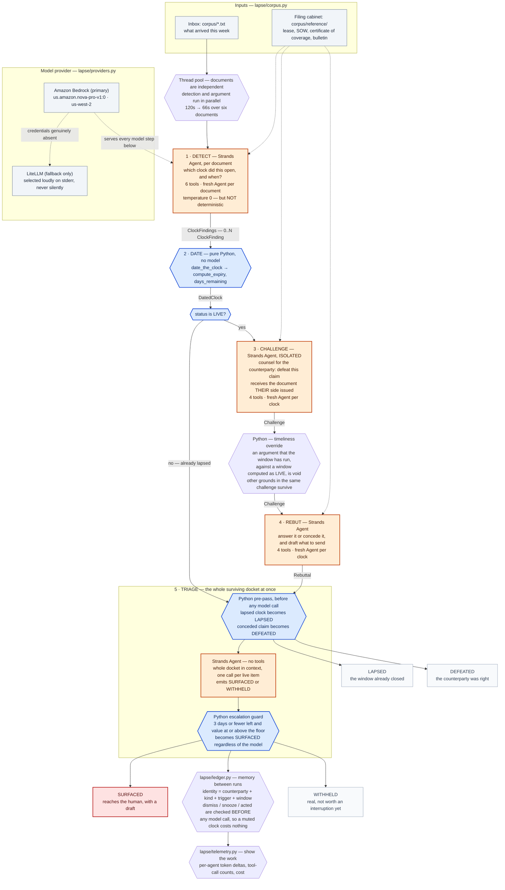

# Lapse — Architecture

**Lapse finds expiring rights.** A right you hold, with a deadline, where a counterparty benefits
if you stay silent: insurance appeal windows, contract scope-objection windows, statutory landlord
repair clocks, recall remedy periods, price protection, mail-in rebates. Nobody chases you about
these — that is the entire point of them.

Four Strands agents and two deterministic Python stages run over an inbox and, almost always,
decide to say nothing. The interesting engineering is in the parts that are *not* a model.

---

## The pipeline



**Legend**

| | |
|---|---|
| **Orange rectangle** | Model-driven — a Strands `Agent` call |
| **Blue hexagon** | Deterministic Python — no tokens involved |
| **Grey** | Input, output, or infrastructure |
| Solid arrow | A typed Pydantic object crossing a stage boundary |
| Dotted arrow | Tool access to the reference corpus, or a provider path |

Two of the four dispositions — `DEFEATED` and `LAPSED` — are assigned by Python and never touch a
model. Every date shipped to a user is computed by `lapse/dates.py`.

---

## Stages

### 1 · DETECT — `lapse/agents/detector.py`

| | |
|---|---|
| Receives | One inbox `Document`, plus today's ISO date |
| Returns | `ClockFindings` (zero or many `ClockFinding`) |
| Tools | All 6 (`DETECTION_TOOLS`) |
| Agent | Fresh `Agent`, fresh conversation, per document |

Reads one incoming document and asks a single question: did this silently open a window during
which the recipient can do something they will lose the ability to do later? It works from the
clock registry (`lapse/clocks.py`), not from vocabulary — no denial letter says "appeal", no client
email says "scope". Where the registry marks a window **INSTRUMENT-DEFINED** (`default_window` is
`None`), the agent is required to open the governing instrument in the reference corpus and quote
the clause that sets the window. Guessing a typical value is the most dangerous thing this system
could do: a plausible wrong deadline produces calm inaction right up until the right is gone.

**Why it exists:** recognising that an ordinary sentence started a clock is a judgment, and this is
the one place a language model is genuinely the right tool.

### 2 · DATE — `date_the_clock()` in `lapse/run.py`, arithmetic in `lapse/dates.py`

| | |
|---|---|
| Receives | `ClockFinding` + today |
| Returns | `DatedClock` — `expiry_date`, `days_remaining`, `status` |
| Tools | None. This is not an agent. |

Calendar or business-day arithmetic (weekends and US federal holidays excluded; business-day
counting begins the first business day *after* the trigger, the convention contracts use).

**Why it exists:** a model asked "when does a 180-day window opened on 2026-03-29 close?" answers
confidently and wrongly. The model decides *which* clock applies; Python decides *when* it closes.
The detector can call `compute_window_expiry` as a check while reasoning, but the date that reaches
the user is recomputed here, outside the model, from the finding's own fields.

### 3 · CHALLENGE — `lapse/agents/adversary.py`

| | |
|---|---|
| Receives | `DatedClock` (the claim as asserted) |
| Returns | `Challenge` — `defeats_claim`, `argument`, `authority`, `confidence` |
| Tools | 4 (`ARGUMENT_TOOLS`: compute_window_expiry + list / read / search reference documents) |
| Agent | Fresh `Agent` per clock |

Works for the other side: the insurer, the client, the landlord, the retailer. It is told to defeat
the claim and pointed at the governing documents, and it looks for the arguments that actually win —
procedural defect first, then exclusions, mootness, then "the clock started earlier and has run".

**Why it exists, and why the isolation is structural:** this agent receives no part of the
advocate's reasoning, shares no conversation object, and is constructed fresh for every clock. Two
agents reading the same evidence under the same framing agree, and that agreement carries no
information — it is consensus wearing the costume of corroboration. An instruction to "consider the
opposing view" inside one agent's prompt produces theatre. A separate agent with an opposed
objective produces an argument. A claim that survives this is one where a human decision genuinely
matters.

Lapsed clocks skip this stage and the next one entirely. A closed window is a fact, not a dispute,
and model calls spent on it buy nothing.

### 4 · REBUT — `lapse/agents/advocate.py`

| | |
|---|---|
| Receives | `DatedClock` + `Challenge` |
| Returns | `Rebuttal` — `survives`, `answer`, `authority`, `drafted_action` |
| Tools | 4 (`ARGUMENT_TOOLS`) |
| Agent | Fresh `Agent` per clock |

Answers the counterparty's argument or concedes it, and where it answers, drafts the actual letter,
email or filing — because a deadline without a draft is anxiety with a date attached. The draft
addresses the counterparty's argument in advance, which is free: they have already told us what
they will say.

**Why it exists:** the advocate is permitted to lose. An advocate that never concedes is a rubber
stamp and the adversary stage becomes decorative. `survives == false` is what produces a `DEFEATED`
disposition.

### 5 · TRIAGE — `lapse/agents/triage.py`

| | |
|---|---|
| Receives | The full `list[Adjudication]` — every clock, end to end |
| Returns | The same list with `Decision` attached to each |
| Tools | **None.** Triage reasons only over the docket it is handed. |
| Agent | One `Agent` reused across the per-item loop |

Three sub-stages, in order:

1. **Python pre-pass.** Lapsed clocks are marked `LAPSED` with the closing date and how long ago.
   Conceded claims are marked `DEFEATED` with the advocate's own reason. Neither disposition
   involves a model call.
2. **Model pass.** Only claims that are live *and* survived the challenge reach the model. The
   whole surviving docket is rendered into the prompt and the model decides one item at a time
   *against that docket* — a per-item "is this important?" question cannot express "yes, but less
   than that other one", which is exactly the judgment that separates an agent from a notification
   system. Surface only if the decision is the human's to make, the value beats the cost of the
   interruption, and the timing is right *now*; otherwise withhold with the actual reason and a
   `revisit_on` date.
3. **Python escalation guard.** Any surviving claim with 3 days or fewer remaining and a value at
   or above the attention floor is promoted to `SURFACED` regardless of what the model concluded.
   The model decides what deserves attention; it does not get to let a valuable right expire this
   week.

**Honest limits of this stage, since the code is public:** the interruption budget is stated to the
model in the prompt and is *not* enforced in Python — nothing post-filters to `budget`, and the
guard can push the surfaced count above it. The guard reads `value_usd or 0.0`, so an unquantified
claim can never self-escalate however few days remain. And the guard iterates the live set only: it
cannot resurrect something already marked `DEFEATED` or `LAPSED`.

---

## Cross-cutting design decisions

### Typed objects cross every boundary

`ClockFindings → DatedClock → Challenge → Rebuttal → Decision`, all Pydantic models in
`lapse/models.py`, accumulated into one `Adjudication` record per clock. A hand-off cannot quietly
degrade into prose the next stage has to re-parse.

Strands ships `Graph` and `Swarm` primitives for multi-agent orchestration, but those flatten
inter-agent hand-offs to text. Lapse therefore orchestrates in plain Python (`quiet_run`) and
passes `AgentResult.structured_output` directly from one stage into the next prompt. That is a
deliberate trade: we give up the built-in topology for a guarantee that the schema survives the
hop. Every `structured_output` call also has an explicit non-null fallback, so "the model returned
nothing" and "the model said no" are different values, not the same empty one.

### Deterministic where being wrong is expensive

Every tool in `lapse/tools.py` is ordinary Python, and the two stages that can *change a
disposition* — the dating stage and the escalation guard — have no model in them at all.

| Stage | Tools available |
|---|---|
| DETECT | `compute_window_expiry`, `list_clock_types`, `lookup_clock_type`, `list_reference_documents`, `read_reference_document`, `search_reference_documents` |
| CHALLENGE, REBUT | `list_reference_documents`, `read_reference_document`, `search_reference_documents` |
| TRIAGE | none |

The asymmetry is the point. The detector needs the registry and the arithmetic. The two arguing
agents need the governing documents and nothing else — they must not be able to redefine the clock
they are arguing about. Triage is handed a docket and reasons about it.

### Agent isolation

The detector, adversary and advocate each construct a fresh `Agent` with its own system prompt and
empty conversation on every call. Nothing is shared between stages except the typed object handed
forward. (Triage is the exception: one `Agent` is reused across its per-item loop, so it carries
conversation state within the triage stage — which is intended, since its whole job is comparative.)

### Provider — `lapse/providers.py`

Amazon Bedrock is the intended home: `us.amazon.nova-pro-v1:0` in `us-west-2`, via
either `AWS_BEARER_TOKEN_BEDROCK` or standard boto3 credentials. `LAPSE_PROVIDER=bedrock` makes
Bedrock mandatory and raises `ProviderUnavailable` rather than degrading. In automatic mode, a
missing credential falls back to LiteLLM — but prints
`Bedrock unavailable (...); this run is NOT using Amazon Bedrock` to stderr first, and the active
provider is recorded in the `RunReport` and printed by `lapse doctor`. An unavailable Bedrock and a
working Bedrock must never produce the same-looking run; otherwise you end up reporting an
AWS-native system that never touched AWS.

---

## Run shape

`quiet_run()` in `lapse/run.py` is the spine:

1. Build the model, record the active provider.
2. For each inbox document: detect, then date every finding. Fan-out — one document can open zero
   or several clocks.
3. For each live clock: challenge, then rebut. Lapsed clocks are skipped.
4. Fan-in: one triage pass over the whole docket.
5. Return a `RunReport` with `surfaced` / `withheld` / `defeated` / `lapsed` views.

```
lapse doctor                    # which provider would serve a run, and why
lapse watch --today 2026-09-14 --budget 1 --attention-floor 100 --json run.json
```

---

## Cross-run memory — `lapse/ledger.py`

A background agent that forgets between runs cannot keep its own promises:
`revisit_on` is a field nobody reads and "remind me in 3 days" is a button with
nothing behind it.

A clock's identity is `counterparty | clock_kind | trigger_date | window_days`.
Deliberately **not** `doc_id` or the summary text — both are model-generated, so
keying on either would defeat the case this exists for (the same denial arriving
twice as two files) and would silently forget the user's dismissals whenever the
generated text drifted.

Muting is checked **before** the argument stages, so a dismissed clock costs zero
model calls. Re-litigating a dismissal is the fastest way to teach someone to
ignore you.

A corrupt or schema-drifted ledger raises `LedgerUnreadable` rather than starting
empty. Silently forgetting every decision and re-raising all of it is precisely
the false report this system exists to avoid.

## Telemetry — `lapse/telemetry.py`

Strands already collects per-invocation tokens and tool-use records and throws
them away. A run now ends with its own trace:

```
19 model invocations across 19 isolated agents · 186,179 in / 9,625 out · $0.180
tools called: list_reference_documents×13, read_reference_document×12,
              compute_window_expiry×10, search_reference_documents×8, ...
```

The 1:1 agent-to-invocation ratio is itself evidence that the isolation this
design claims is real, and the tool counts show the agent genuinely reads the
governing instruments rather than reasoning from the incoming document alone.

**One trap worth recording:** `accumulated_usage` is cumulative *per agent*, so
summing it across invocations double-counts any agent called twice. The collector
records deltas and holds a strong reference to each agent, because `id()` is
recycled after garbage collection — keying on it produced a completely plausible
and completely wrong token count during development.

## Concurrency

Documents are independent, so detection and the argument stage run in a thread
pool (`max_workers=8`). Six documents: **120s → 66s**. Each stage still builds a
fresh `Agent`, so parallelism does not weaken the isolation.

## What this diagram does not claim

Detection runs at `temperature=0.0`, and that is **not** determinism. Measured
over six runs of the identical corpus it returned **4, 5, 5, 5, 6 and 6** clocks.
Temperature constrains sampling, not tool-use paths or structured-output retries.
Detection recall is the central open problem, and it is the first thing an eval
harness should measure.
